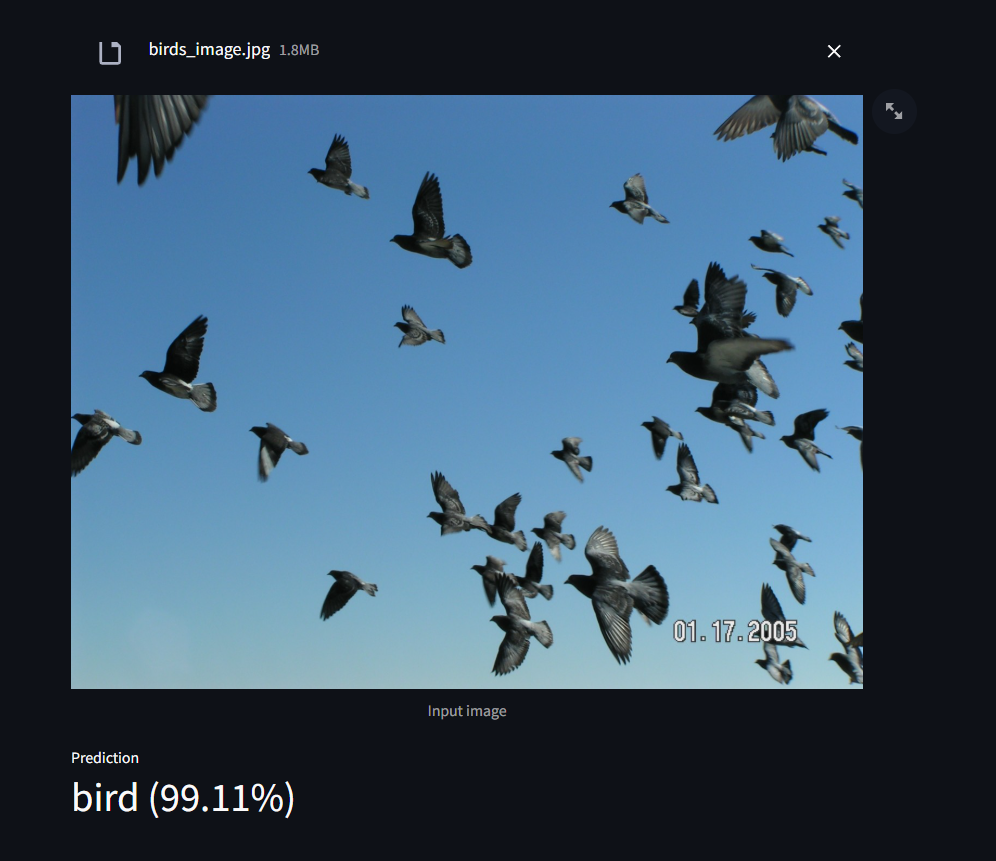
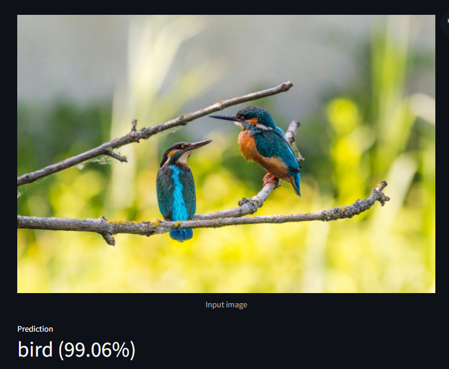
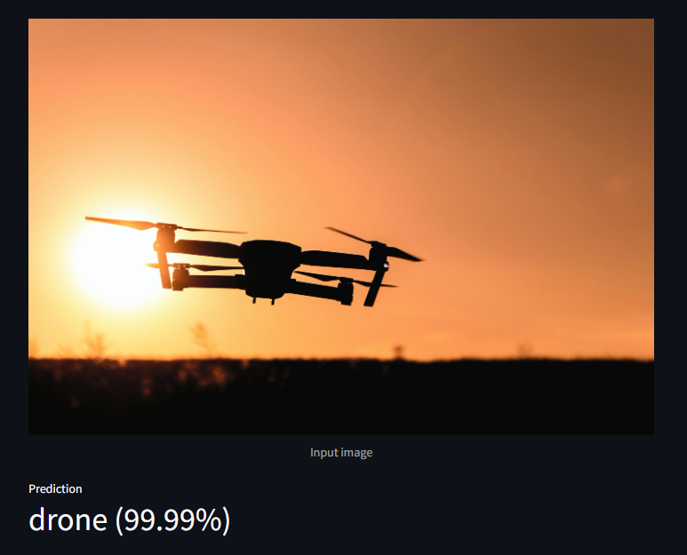
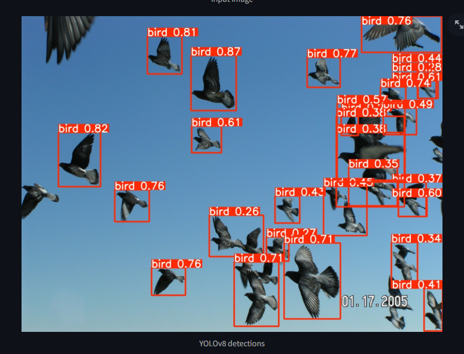
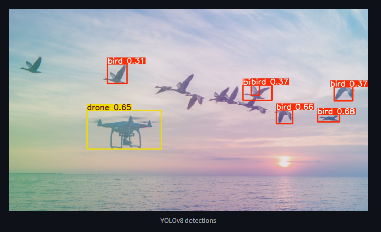

 # 🦅 Aerial Object Classification & Detection

This repository contains a complete Deep Learning and Computer Vision pipeline for classifying Bird vs Drone and detecting aerial objects using:

  - Custom CNN
  - Transfer Learning Models (ResNet50, MobileNetV2, EfficientNetB0)
  - YOLOv8 Object Detection
  - Streamlit Web Application

The project covers all stages: EDA → Preprocessing → Training → Model Comparison → YOLO Training → Deployment.

-------------------------------------------------------------

# 🖼️ Sample Output Images

###  Classification Example
<p align="center">
  
  
  
</p>

###  YOLOv8 Detection Example

<p align="center">
  
  
</p>


-------------------------------------------------------------

# 📁 Project Structure
```
Project-2/
└── Aerial_Object_Classification_Detection/
    ├── app.py
    ├── requirements.txt
    ├── .gitignore
    │
    ├── config/
    │     ├── class_weights.json
    │     ├── data.yaml
    │     └── preprocessing_config.txt
    │
    ├── data/
    │     ├── classification_dataset/
    │     │     ├── train/
    │     │     ├── valid/
    │     │     └── test/
    │   └── object_detection_Dataset/
    |           ├── train/
    |           │     ├── images/
    |           │     └── labels/
    |           │
    |           ├── valid/
    |           │     ├── images/
    |           │     └── labels/
    |           │
    |           ├── test/
    |           │     ├── images/
    |           │     └── labels/
    ├── models/
    │     ├── custom_cnn_best.h5
    │     ├── custom_cnn_best.keras
    │     ├── mobilenetv2_best.h5
    │     ├── mobilenetv2_best.keras
    │     ├── efficientnetb0_best.keras
    │     ├── resnet50_best.keras
    │     ├── yolov8_yolov8n_bird_drone_best.pt
    │     └── yolo_runs/
    │
    ├── notebooks/
    │     ├── 01_EDA_Preprocessing.ipynb
    │     ├── 02_Custom_CNN_Classification.ipynb
    │     ├── 03_Transfer_Learning.ipynb
    │     ├── 04_Model_Comparison.ipynb
    │     └── 05_yolov8_object_detection.ipynb
    │
    └── reports/
          └── model_comparison/

```
-------------------------------------------------------------


# ⚠️ Important Note — Model Files

Model files are NOT included in this GitHub repository
Because GitHub blocks uploads larger than 100 MB.

### Missing files (generated via notebooks):

- custom_cnn_best.keras
- resnet50_best.keras
- mobilenetv2_best.keras
- efficientnetb0_best.keras
- yolov8_yolov8n_bird_drone_best.pt

👉 They will be created automatically when running notebooks in Google Colab.

OR you can download the complete project including models:

🔗 https://drive.google.com/drive/folders/1IL1tq7V8FDzarkBf0JlfoV0MR-9RPrAN?usp=sharing

-------------------------------------------------------------


# 🧠 Training Pipeline (Google Colab)

### ▶️ Run notebooks in order:

1) 01_EDA_Preprocessing.ipynb
2) 02_Custom_CNN_Classification.ipynb
3) 03_Transfer_Learning.ipynb
4) 04_Model_Comparison.ipynb
5) 05_yolov8_object_detection.ipynb

### ▶️ Before running:

- Check dataset paths
- Ensure Drive mount
- Validate BASE_DIR, DATA_DIR, MODELS_DIR

### ▶️ Output directory:
```
models/
```

📌 Note:
If you downloaded the project from the Google Drive link, you can skip the entire training pipeline because the Drive version already includes all trained model files.
You only need the training notebooks if you want to retrain models, modify datasets, or experiment.

-------------------------------------------------------------

# 💻 Running the Streamlit App

### Go to the project root:
```
Project-2/Aerial_Object_Classification_Detection/
```
📌 Note:
You may change the project directory according to your system,
but ensure all paths inside the code/notebooks point to the correct locations.

### 1️⃣ Create Virtual Environment (Windows)
```
python -m venv venv
venv\Scripts\activate
```

### 1️⃣ Create Virtual Environment (Mac/Linux)
```
python3 -m venv venv
source venv/bin/activate
```

### 2️⃣ Install Requirements
```
pip install -r requirements.txt
```

### 3️⃣ Run the App
```
streamlit run app.py
```

-------------------------------------------------------------

# 🚀 Features

### ✔️ Bird vs Drone Classification

Uses 4 model families:

- Custom CNN
- ResNet50
- MobileNetV2
- EfficientNetB0

Includes:

- Class imbalance handling
- Data augmentation
- Confusion matrix
- Classification report
- Weighted F1 score
- Auto-best model selection

### ✔️ YOLOv8 Object Detection

- Real-time bird/drone detection
- Bounding boxes
- Confidence scores
- Multi-object support

### ✔️ Streamlit App

- Upload image
- Choose mode (Classification / Detection)
- Loads best model (selected_model.json)
- Clean UI
  
-------------------------------------------------------------

# 🔍 How It Works

###🔹 Classification Mode

- Loads best selected model
- Predicts Bird or Drone
- Returns confidence score

###🔹 Detection Mode

- Runs YOLOv8
- Draws bounding boxes
- Displays confidence
- Supports multiple objects

-------------------------------------------------------------


# 📊 Analytics Included

- Model comparison metrics
- Misclassified samples
- YOLOv8 evaluation
- Best-model auto-selection
  
-------------------------------------------------------------


# ⭐ Future Enhancements

- Multi-class (Bird / Drone / Plane / Helicopter)
- TFLite mobile deployment
- Real-time camera inference
- Docker support
- Webcam live detection

-------------------------------------------------------------

# 🤝 Author

### Predeep Kumar
Aerial Object Classification & Detection — Deep Learning + Computer Vision Project

-------------------------------------------------------------
